# KOREAN-tokenizer

Hangul-awareness benchmarks for production LLM tokenizers.

<p align="center">
  
</p>

> **Thesis.** Hangul composes all 11,172 syllables from 67 reusable Jamo (Korean modular alphabet) symbols.
> Eight production tokenizers — OpenAI, Google, Alibaba, DeepSeek, Z.ai, Meta, LG AI Research, Motif Technologies —
> do not use that 67-jamo inventory as structural primitives.
> Proposal: [huggingface/tokenizers#1975](https://github.com/huggingface/tokenizers/issues/1975) ·
> companion: [google/sentencepiece#1197](https://github.com/google/sentencepiece/issues/1197),
> merged TSV in [#1200](https://github.com/google/sentencepiece/pull/1200)

## Results

Measured 2026-08-25–26 across eight production tokenizers, including Korea-focused K-EXAONE 2.0 and Motif 3.

> 🔑 **Six of eight expand canonically equivalent decomposed Hangul by 3.5–8.5×.**
> Qwen3.8 and K-EXAONE 2.0 are immune at exactly **1.00×** — both ship an [`NFC`](https://www.unicode.org/reports/tr15/) normalizer.

| Metric | o200k / GPT-5·GPT-4o (200,019) | Gemma 4 / Google (262,144) | Qwen3.8 / Alibaba (248,044) | DeepSeek-V4-Flash (128,000) | GLM-5.2\* (154,820) | Muse Glimmer / Meta (200,000) | K-EXAONE 2.0 / LG AI Research (153,600) | Motif 3 / Motif Technologies (220,160) |
|---|---|---|---|---|---|---|---|---|
| Atomic single-syllable tokens | 700 (**6.3%**) | 1,733 (**15.5%**) | 976 (**8.7%**) | 444 (**4.0%**) | 295 (**2.6%**) | 835 (**7.5%**) | 1,576 (**14.1%**) | 1,420 (**12.7%**) |
| Multi-syllable merges | 1,219 | 2,270 | 5,099 | 416 | 109 | 4,030 | 36,207 | **48,271** |
| Jamo-containing tokens (Korean modular alphabet) | 8 | 117 | 14 | **0** | **0** | 5 | 98 | 62 |
| Unicode normalizer | none | `Replace` (`▁`) | **`NFC`** | `Sequence` | none | none | **`NFC`** | none |
| Korean sample — [`NFC`](https://www.unicode.org/reports/tr15/) / [`NFD`](https://www.unicode.org/reports/tr15/) tokens | 303 / 2,586 | 274 / 962 | 255 / 255 | 330 / 2,103 | 395 / 2,429 | 267 / 1,921 | 192 / 192 | **185** / 1,162 |
| **NFD blow-up factor** | **8.53×** | 3.51× | **1.00×** | 6.37× | 6.15× | 7.19× | **1.00×** | 6.28× |

\* Subject of this study; GLM-5.3 shares its base model, so findings apply there too.
Vocab sizes in parentheses.

### What the results mean

1. **Canonical equivalence is routinely broken.** NFC and NFD forms of the same text are
   interchangeable under Unicode, yet five tokenizers charge 3.5–8.5× more tokens for the
   decomposed form — pure representation fragility, not linguistic difference.
2. **Bigger vocabularies do not imply Hangul structure.** Gemma 4 owns the largest
   vocabulary (262K) and still covers only 15.5% of syllables with atomic tokens; GLM-5.2
   manages 2.6%. The remaining ~84–97% ride on accidental merges or mid-character byte
   fragments.
3. **Compression is not canonical robustness.** Motif 3 is the most token-efficient tokenizer
   here on the Korean sample at **185 tokens**, with **48,271** multi-syllable merges, yet its
   canonically equivalent NFD form expands to 1,162 tokens (**6.28×**). Aggressive statistical
   compression does not make Unicode representation differences disappear.
4. **Canonical robustness is not structural awareness.** K-EXAONE 2.0 holds NFC/NFD at
   **1.00×** through NFC normalization and reaches 192 tokens on the sample, yet has only 98
   jamo-containing tokens. It solves representation stability without using the 67-jamo
   inventory as primitives.
5. **Blindness outlives model generations.** DeepSeek-V4 reuses the V3 tokenizer design;
   Muse Glimmer inherits Llama 4's unchanged. Each flagship generation keeps shipping
   inherited tokenization decisions for Hangul.

## Three independent axes

**Problem A — Canonical robustness.**
`한` (NFC) and `한` (NFD) are canonically equivalent strings of the same word.
Token cost should not depend on which form arrives.

**Problem B — Structural awareness.**
11,172 opaque syllable blocks vs the actual primitives: **19 initial + 21 medial + 27 final**
jamo that compose them.

**Problem C — Compression / fertility.**
How many tokens ordinary Korean text requires, independent of whether the tokenizer is
canonically robust or structurally aware.

> **NFC normalization fixes representation instability. Better compression reduces token cost.
> Neither one by itself makes a tokenizer Hangul-aware.**

Qwen3.8 and K-EXAONE 2.0 settle Problem A (blow-up 1.00×) while staying blind to Problem B.
Motif 3 is the clearest Problem C counterexample: it reaches the best sample compression here
at 185 tokens while still blowing NFD up by 6.28×. No measured tokenizer uses the 67-jamo
inventory as primitives — that is what the RFC proposal targets.

## How Hangul composes

Every syllable block (U+AC00–D7A3) is arithmetic:

```text
19 initials × 21 vowels × 28 final states   (27 finals, or none)
= 11,172 modern syllable blocks
```

drawn from just **67 modern jamo symbols** — 24 basic letters plus their derived compounds.
Decomposition and recomposition are exact integer transforms; no lookup table needed.
Unicode preserves both views (precomposed blocks and conjoining jamo). Production BPE
tokenizers flatten it again.

## Methodology

1. **Vocabulary anatomy** — decode every vocab entry back to text (through the GPT-2
   byte-level alphabet where tokens are stored that way, as plain UTF-8 otherwise), then
   classify:
   - exactly one Hangul syllable → *atomic*
   - ≥ 2 syllables → *multi-syllable merge*
   - contains any jamo character (U+1100–11FF / U+3130–318F) → *jamo-containing*
   - invalid UTF-8 → *byte fragment*
2. **Canonical-equivalence stress test** — encode an identical 465-char Korean paragraph
   (on the scientific design of Hangul) in NFC vs NFD form. Any token-count gap between
   canonically equivalent strings measures pure representation fragility.

## Unicode note

```text
가  U+AC00   precomposed Hangul syllable

ᄀ  U+1100   conjoining jamo · choseong
ᅡ  U+1161   conjoining jamo · jungseong
ᆨ  U+11A8   conjoining jamo · jongseong

ㄱ  U+3131   compatibility jamo (keyboard legacy)
```

NFD produces **conjoining jamo**, not compatibility jamo. The two ranges are different
codepoints for related-but-distinct purposes; this benchmark's NFD path exercises the
conjoining range only.

## Reproduce

```bash
uv run python src/analyze_tokenizer_json.py <path/to/tokenizer.json>
uv run python src/analyze_tiktoken_encoding.py o200k_base
```

Any HF `tokenizer.json` works for the first script — both GPT-2-alphabet vocab storage and
plain-text storage (SentencePiece-derived) are handled.

## Reproducibility

Results describe these exact revisions; providers may update tokenizers at any time.

| Tokenizer | Source · revision | Measured |
|---|---|---|
| o200k_base | `tiktoken` 0.14.0 built-in encoding | 2026-08-25 |
| GLM-5.2 | [`zai-org/GLM-5.2`](https://huggingface.co/zai-org/GLM-5.2) @ `b4734de` | 2026-08-25 |
| Gemma 4 | [`google/gemma-4-E4B-it`](https://huggingface.co/google/gemma-4-E4B-it) @ `ee0ef60` | 2026-08-25 |
| Qwen3.8 | [`Qwen/Qwen3.8-27B`](https://huggingface.co/Qwen/Qwen3.8-27B) @ `1d4bf0f` | 2026-08-25 |
| DeepSeek-V4-Flash | [`deepseek-ai/DeepSeek-V4-Flash-0731`](https://huggingface.co/deepseek-ai/DeepSeek-V4-Flash-0731) @ `7872f01` | 2026-08-25 |
| Muse Glimmer | [`meta-models/Muse-Glimmer-30B`](https://huggingface.co/meta-models/Muse-Glimmer-30B) @ `a4e59da` | 2026-08-25 |
| K-EXAONE 2.0 | [`LGAI-EXAONE/K-EXAONE-2.0-750B-A37B`](https://huggingface.co/LGAI-EXAONE/K-EXAONE-2.0-750B-A37B) @ `fec0c8d` | 2026-08-25 |
| Motif 3 | [`Motif-Technologies/Motif-3`](https://huggingface.co/Motif-Technologies/Motif-3) @ `883d5c4` | 2026-08-26 |

## What this benchmark does not claim

- NFC/NFD token-count parity is **not** the same as jamo-aware modeling — see
  *Three independent axes* above.
- Jamo counts in a vocabulary are a proxy for structural awareness, not a measurement of
  what models do internally with those structures.
- Token efficiency alone does not demonstrate downstream quality; a model layer can
  compensate for a structure-blind tokenizer at some cost. This benchmark prices that cost,
  it does not claim models fail.

## References

### Canonical robustness

- [Unicode Standard Annex #15: Unicode Normalization Forms](https://www.unicode.org/reports/tr15/)
  - Normative definition of NFC/NFD canonical equivalence used by the stress test in this benchmark.
- [Unicode Korean FAQ](https://www.unicode.org/faq/korean.html)
  - Background on precomposed Hangul syllables and conjoining jamo.

### Hangul structural awareness

- [*A Sub-Character Architecture for Korean Language Processing* — EMNLP 2017](https://aclanthology.org/D17-1075/)
  - Early evidence that jamo-level representations shrink the observation space while exposing reusable Hangul structure.
- [*Jamo Pair Encoding* — LREC 2020](https://aclanthology.org/2020.lrec-1.429/)
  - Applies BPE directly over Hangul jamo to reduce Korean vocabulary cost.
- [*KR-BERT: A Small-Scale Korean-Specific Language Model* — 2020](https://arxiv.org/abs/2008.03979)
  - Demonstrates a competitive Korean-specific model built with a compact sub-character vocabulary; useful evidence without isolating tokenizer causality.
- [*Jamo-Level Subword Tokenization in Low-Resource Korean Machine Translation* — ACL 2025](https://aclanthology.org/2025.loresmt-1.8/)
  - Reports jamo-level BPE gains in low-resource settings, while noting syllable-level tokenization can still win with more data.
- [*KOMBO: Korean Character Representations Based on the Combination Rules of Subcharacters* — Findings of ACL 2024](https://aclanthology.org/2024.findings-acl.302/)
  - Model-level evidence that explicitly encoding Hangul combination rules can improve Korean NLU; this is not a tokenizer-efficiency result.
- [*SCRIPT* — Findings of ACL 2026](https://aclanthology.org/2026.findings-acl.104/)
  - Model-level evidence that Hangul compositional information can be injected into existing subword representations.

### Compression and fertility

- [*Length-aware Byte Pair Encoding for Mitigating Over-segmentation in Korean Machine Translation* — Findings of ACL 2024](https://aclanthology.org/2024.findings-acl.135/)
  - LeVoC shows that Korean over-segmentation is itself a useful optimization target, separate from structural awareness.
- [*Thunder-Tok: Minimizing Tokens per Word in Tokenizing Korean Texts for Generative Language Models* — 2025](https://arxiv.org/abs/2506.15138)
  - Korean tokenizer design focused on fertility; its ablations also show that structural seed filtering matters for downstream quality.
- [*MUTANT: A Recipe for Multilingual Tokenizer Design* — 2026; formerly IndicSuperTokenizer](https://arxiv.org/abs/2511.03237)
  - Provides a recent multilingual methodology precedent for comparing normalization choices and tokenizer fertility.
- [*Parity-Aware BPE* — ACL 2026](https://aclanthology.org/2026.acl-long.342/)
  - Treats cross-language compression disparity as an explicit BPE optimization objective, including Korean evaluation.
- [*Motif 3 Technical Report* — 2026](https://arxiv.org/abs/2608.09119)
  - Uses SuperBPE to optimize multilingual compression; its released tokenizer is a useful counterexample showing that strong Korean compression can coexist with poor NFC/NFD parity.

### Generalization and design caveats

- [*BPE Stays on SCRIPT: Structured Encoding for Robust Multilingual Pretokenization* — 2025](https://arxiv.org/abs/2505.24689)
  - Separates Unicode-script structure from statistical merging and enforces character integrity, eliminating partial UTF-8 token fragments.
- [*Separate Before You Compress: The WWHO Tokenization Architecture* — 2026](https://arxiv.org/abs/2603.25309)
  - Generalizes the same structure-before-compression principle to complex scripts through SGPE and a zero-breakage guarantee.
- [*Improving Korean NLP Tasks with Linguistically Informed Subword Tokenization and Sub-character Decomposition* — 2023](https://arxiv.org/abs/2311.03928)
  - A useful design caveat: selective, linguistically informed decomposition can outperform indiscriminate decomposition.
- [*Getting the Most Out of Your Tokenizer for Pre-training and Domain Adaptation* — ICML 2024](https://proceedings.mlr.press/v235/dagan24a.html)
  - Shows that tokenizer size, pre-tokenization, and training data materially affect speed, context efficiency, and downstream performance.
- [*Don’t Touch My Diacritics* — NAACL 2025](https://aclanthology.org/2025.naacl-short.25/)
  - Documents the risks of inconsistent Unicode preprocessing, useful context when arguing for normalization choices that preserve distinctions.

## Files

| File | Purpose |
|---|---|
| [`src/hangul_metrics.py`](src/hangul_metrics.py) | Shared classification + NFC/NFD blow-up logic |
| [`src/analyze_tokenizer_json.py`](src/analyze_tokenizer_json.py) | Analyze any HF `tokenizer.json` |
| [`src/analyze_tiktoken_encoding.py`](src/analyze_tiktoken_encoding.py) | Analyze any `tiktoken` encoding |
| [`svg/hangul-hero.svg`](svg/hangul-hero.svg) | Editable source for the animated Hangul hero banner |
| [`docs/hangul-hero.svg`](docs/hangul-hero.svg) | README-rendered copy of the hero banner |
