# KOREAN-tokenizer

Measuring whether modern tokenizers understand **Hangul structure** or merely compress its surface forms.

<p align="center">
  
</p>

Hangul does not require 11,172 unrelated symbols. Modern syllable blocks are composed from **67 positional Jamo characters** — 19 initials, 21 medials, and 27 finals — plus the null-final state.

```text
19 initials × 21 medials × 28 final states
                     │
                     ▼
           11,172 modern syllables

67 reusable Jamo characters + one null-final state
```

This repository studies three properties that are easy to conflate:

1. **Canonical robustness** — does token cost stay stable for canonically equivalent NFC/NFD text?
2. **Structural awareness** — does the tokenizer expose reusable Hangul composition rather than only memorized syllables, phrases, or byte fragments?
3. **Compression / fertility** — how many tokens does ordinary Korean text require?

> **Normalization, structural representation, and compression are independent tokenizer design axes.**

Proposal: [huggingface/tokenizers#1975](https://github.com/huggingface/tokenizers/issues/1975) · companion: [google/sentencepiece#1197](https://github.com/google/sentencepiece/issues/1197) · merged mapping in [google/sentencepiece#1200](https://github.com/google/sentencepiece/pull/1200)

## Current status

```text
DONE  Production tokenizer anatomy
      8 released tokenizers inspected at fixed revisions
        │
        ▼
DONE  Controlled SentencePiece precursor
      Wikipedia · 32K baseline vs 32K Jamo-aware BPE
        │
        ▼
NEXT  Implementation-controlled 2×2 benchmark
      CC-100 Korean training corpus
      100 MiB primary + 1 GiB scale replication
        │
        ├─ precomposed / BPE
        ├─ Jamo        / BPE
        ├─ precomposed / SuperBPE
        └─ Jamo        / SuperBPE
              │
              ▼
      FLORES+ kor_Hang/devtest evaluation
```

The completed SentencePiece experiment is **precursor evidence**, not one cell of the upcoming SuperBPE 2×2. The new experiment uses one tokenizer implementation for all four cells so representation and compression policy can be separated cleanly.

## Production tokenizer anatomy

Measured 2026-08-25–26. These are **vocabulary/configuration measurements**; cross-tokenizer compression and NFC/NFD rankings are withheld until the shared reference corpus is evaluated.

| Tokenizer | Vocab | Atomic Hangul syllables | Coverage of 11,172 | Multi-syllable pieces | Jamo-containing pieces | Normalizer |
|---|---:|---:|---:|---:|---:|---|
| o200k / OpenAI | 200,019 | 700 | 6.3% | 1,219 | 8 | none |
| Gemma 4 / Google | 262,144 | 1,733 | 15.5% | 2,270 | 117 | `Replace` (`▁`) |
| Qwen3.8 / Alibaba | 248,044 | 976 | 8.7% | 5,099 | 14 | `NFC` |
| DeepSeek-V4-Flash | 128,000 | 444 | 4.0% | 416 | 0 | `Sequence` |
| GLM-5.2 | 154,820 | 295 | 2.6% | 109 | 0 | none |
| Muse Glimmer / Meta | 200,000 | 835 | 7.5% | 4,030 | 5 | none |
| K-EXAONE 2.0 / LG AI Research | 153,600 | 1,576 | 14.1% | 36,207 | 98 | `NFC` |
| Motif 3 | 220,160 | 1,420 | 12.7% | **48,271** | 62 | none |

### What this establishes

- **Vocabulary size is not structural awareness.** Even the highest atomic coverage in this table is 15.5% of modern Hangul syllables.
- **Learned Korean merges are not Jamo primitives.** Motif 3 has the largest measured multi-syllable inventory while containing only 62 Jamo-bearing pieces.
- **Tokenizer design persists across model generations.** Vocabulary and normalizer choices can be inherited independently of later model improvements.

No tokenizer in this table uses the modern positional Jamo inventory as its primary Hangul representation.

## Controlled precursor — SentencePiece BPE

The first controlled experiment asked a narrower question: **what changes if Hangul syllables are decomposed before ordinary BPE training?**

```text
same Korean Wikipedia train split
same SentencePiece 0.2.2 BPE
same 32K vocabulary
same material training settings
             │
      ┌──────┴──────┐
      ▼             ▼
   identity      Hangul → Jamo
   baseline      mapping
      │             │
      └──────┬──────┘
             ▼
   same Wikipedia held-out split
```

The Jamo path uses the repository's 11,172-entry [`data/korean_hangul_jamo.tsv`](data/korean_hangul_jamo.tsv) mapping. It decomposes only modern precomposed Hangul syllables into conjoining Jamo; it is not full Unicode NFD.

### Primary 32K result

| Metric | Baseline BPE 32K | Jamo-aware BPE 32K |
|---|---:|---:|
| Held-out NFC tokens | 7,449,254 | **7,339,458** (**−1.47%**) |
| Held-out NFD/NFC ratio | **6.9809×** | **1.0013×** |
| UTF-8 bytes / token | 4.6320 | **4.7013** |
| Tokens / Hangul syllable | 0.8146 | **0.8026** |
| Jamo-containing vocabulary pieces | 75 | **23,657** |
| NFC-recomposed atomic syllables | **1,960** | 1,122 |
| NFC-recomposed multi-syllable pieces | 18,312 | **21,461** |
| Rare-tail isolated tokens / occurrence¹ | 4.0000 | **2.2281** |
| Rare-tail byte tokens / occurrence¹ | 3.0000 | **0.0000** |

The result is useful for three separate reasons:

```text
Jamo decomposition
├─ canonical robustness  → large improvement
├─ structural fallback   → rare Hangul avoids byte fallback
└─ compression           → no penalty at this 32K operating point
                            (1.47% fewer held-out NFC tokens)
```

¹ The rare-tail probe uses syllables occurring at most five times in the Wikipedia training split and reappearing in its held-out split: 50 types / 57 occurrences. All 11,172 modern syllables occur at least once in that training corpus, so this is **rare-tail fallback behavior**, not unseen-syllable or OOD generalization.

### Controls

A 32K `nmt_nfkc` control reaches **7,107,482** held-out NFC tokens and a **1.0000×** NFD/NFC ratio (one-token difference). It compresses better than both primary models while remaining syllable-based. That is evidence that canonical robustness, structural awareness, and compression should not be collapsed into one score.

A pre-registered Jamo 24K auxiliary model uses **7,636,747** held-out NFC tokens. Reducing the vocabulary by 25% is therefore not free at this operating point, even though the rare-tail byte-fallback advantage remains.

### Precursor corpus

The precursor used the first three Korean Wikipedia `pages-articles-multistream` shards. Streaming extraction produced **144,018 articles / 319,968,030 characters**. A deterministic article-level SHA-256 split produced:

- train: **136,757 documents / 675,056,542 bytes**;
- held-out: **7,261 documents / 34,519,812 bytes**;
- train SHA-256: `17d26d1136085e907d2e5e9506c6527ec1db4989840812a507624a0b088801ba`;
- held-out SHA-256: `5bb1ae5d792ecc0444b925162c119a2aa6a0550e617d6e9646f007a4dcbde5de`.

This split is in-distribution and is not cross-document deduplicated. It measures tokenizer behavior, not downstream language-model quality.

## Next experiment — representation × compression

The next benchmark separates **what Hangul is represented as** from **how aggressively that representation is compressed**.

| | Ordinary BPE | SuperBPE |
|---|---|---|
| **Precomposed Hangul** | P-BPE | P-SuperBPE |
| **Jamo representation** | J-BPE | J-SuperBPE |

All four cells will use the same official SuperBPE/custom-`tokenizers` implementation family, final vocabulary size, source documents, and evaluation text. Only the intended axis changes.

### Training corpus

**CC-100 Korean** is the primary training corpus for the new experiment. The public Korean archive is `ko.txt.xz`; the XLM-R appendix reports the Korean CC-100 corpus as **5.644B tokens / 54.2 GiB**. The experiment uses only the Korean corpus, while preserving English words, numbers, URLs, punctuation, and other characters that naturally occur inside Korean documents.

Two source-text budgets are pre-registered:

- **100 MiB decoded UTF-8 source text** — primary controlled run;
- **1 GiB decoded UTF-8 source text** — 10× scale replication.

The budget is measured **before** Jamo transformation. Both representations therefore see exactly the same source documents.

### Evaluation

The headline public benchmark is **FLORES+ `kor_Hang/devtest` (1,012 sentences)**. The exact dataset revision will be pinned before publishable numbers are reported.

The existing Wikipedia held-out split may be used only as optional domain-scale validation and to connect the new experiment to the precursor. Benchmark-set roles and references live in [`docs/test-sets.md`](docs/test-sets.md).

### Research question

```text
Jamo chooses the structural alphabet.
SuperBPE chooses how far statistical merging may extend.

If the two are complementary:
structure-aware representation + aggressive compression
should coexist rather than trade off by construction.
```

No results from this 2×2 experiment are reported yet.

## How Hangul composes

Every modern Hangul syllable U+AC00–U+D7A3 can be decomposed arithmetically:

```text
19 choseong × 21 jungseong × 28 jongseong states
= 11,172 syllable blocks

28 jongseong states = 27 final characters + no-final state
```

The positional characters are distinct from compatibility Jamo:

```text
가  U+AC00   precomposed Hangul syllable

ᄀ  U+1100   conjoining Jamo · choseong
ᅡ  U+1161   conjoining Jamo · jungseong
ᆨ  U+11A8   conjoining Jamo · jongseong

ㄱ  U+3131   compatibility Jamo
```

Unicode NFD produces **conjoining Jamo**, not compatibility Jamo.

## What is measured

### Vocabulary anatomy

Every vocabulary entry is decoded back to text and classified as:

- exactly one Hangul syllable → **atomic syllable**;
- at least two Hangul syllables → **multi-syllable piece**;
- contains Jamo code points → **Jamo-containing piece**;
- invalid UTF-8 → **byte fragment**.

For Jamo tokenizers, pieces are also NFC-recomposed before span statistics are computed so a decomposed multi-syllable piece is not mislabeled as having zero Hangul span.

### Corpus metrics

Reference-corpus evaluation reports corpus totals rather than isolated examples, including:

- total tokens;
- UTF-8 bytes/token;
- characters/token;
- tokens/Hangul syllable;
- NFC vs NFD token totals and ratio;
- document/sentence distribution summaries;
- unknown or byte-fallback behavior when observable.

[`docs/test-sets.md`](docs/test-sets.md) is the authority for evaluation-set roles.

## Reproduce implemented work

```bash
# Production vocabulary anatomy
uv run python src/analyze_tokenizer_json.py <path/to/tokenizer.json>
uv run python src/analyze_tiktoken_encoding.py o200k_base

# Completed SentencePiece precursor, after obtaining the recorded Wikipedia shards
uv run python src/extract_wikipedia.py \
  data/kowiki-shard1.xml.bz2 \
  data/kowiki-shard2.xml.bz2 \
  data/kowiki-shard3.xml.bz2
uv run python src/split_corpus.py
uv run python src/train_sentencepiece.py --with-nfkc-control --aux-jamo-vocab-size 24000
uv run python src/compare_sentencepiece.py
```

CC-100/SuperBPE preparation and training code is **planned work** and is intentionally not presented here as already reproducible.

Large corpora and trained model artifacts stay local and are ignored by Git.

## Production revisions

Results describe these exact tokenizer revisions; providers may update tokenizers later.

| Tokenizer | Source · revision | Measured |
|---|---|---|
| o200k_base | `tiktoken` 0.14.0 built-in encoding | 2026-08-25 |
| GLM-5.2 | [`zai-org/GLM-5.2`](https://huggingface.co/zai-org/GLM-5.2) @ `b4734de` | 2026-08-25 |
| Gemma 4 | [`google/gemma-4-E4B-it`](https://huggingface.co/google/gemma-4-E4B-it) @ `ee0ef60` | 2026-08-25 |
| Qwen3.8 | [`Qwen/Qwen3.8-27B`](https://huggingface.co/Qwen/Qwen3.8-27B) @ `1d4bf0f` | 2026-08-25 |
| DeepSeek-V4-Flash | [`deepseek-ai/DeepSeek-V4-Flash-0731`](https://huggingface.co/deepseek-ai/DeepSeek-V4-Flash-0731) @ `7872f01` | 2026-08-25 |
| Muse Glimmer | [`meta-models/Muse-Glimmer-30B`](https://huggingface.co/meta-models/Muse-Glimmer-30B) @ `a4e59da` | 2026-08-25 |
| K-EXAONE 2.0 | [`LGAI-EXAONE/K-EXAONE-2.0-750B-A37B`](https://huggingface.co/LGAI-EXAONE/K-EXAONE-2.0-750B-A37B) @ `fec0c8d` | 2026-08-25 |
| Motif 3 | [`Motif-Technologies/Motif-3`](https://huggingface.co/Motif-Technologies/Motif-3) @ `883d5c4` | 2026-08-26 |

## Interpretation boundaries

- Tokenizer efficiency is **not** downstream LM quality.
- NFC/NFD parity is **not** the same as Jamo-aware structure.
- Jamo counts in a vocabulary are a structural proxy, not a measurement of model-internal representations.
- Wikipedia precursor results are in-distribution and do not establish OOD generalization.
- The upcoming CC-100 experiment is Korean-only; it does not establish multilingual side effects.
- Negative, neutral, or scale-dependent results are valid outcomes of the 2×2 experiment.

## References

### Unicode and Hangul structure

- [Unicode Standard Annex #15: Unicode Normalization Forms](https://www.unicode.org/reports/tr15/) — normative NFC/NFD definitions.
- [Unicode Korean FAQ](https://www.unicode.org/faq/korean.html) — precomposed Hangul and conjoining Jamo background.
- [*A Sub-Character Architecture for Korean Language Processing* — EMNLP 2017](https://aclanthology.org/D17-1075/) — early sub-character Korean representation evidence.
- [*Jamo Pair Encoding* — LREC 2020](https://aclanthology.org/2020.lrec-1.429/) — BPE over Hangul Jamo.
- [*Jamo-Level Subword Tokenization in Low-Resource Korean Machine Translation* — ACL 2025](https://aclanthology.org/2025.loresmt-1.8/) — recent Jamo-level BPE evidence and caveats.

### Training corpora and evaluation

- [CC-100 official corpus](https://data.statmt.org/cc-100/) — public monolingual corpus downloads including Korean `ko.txt.xz`.
- [*Unsupervised Cross-lingual Representation Learning at Scale* — XLM-R](https://aclanthology.org/2020.acl-main.747/) — CC-100 construction/use and language-level corpus statistics.
- [`docs/test-sets.md`](docs/test-sets.md) — FLORES+ and local evaluation-set contracts with source references.

### Compression and tokenizer design

- [*Length-aware Byte Pair Encoding for Mitigating Over-segmentation in Korean Machine Translation* — Findings of ACL 2024](https://aclanthology.org/2024.findings-acl.135/) — Korean over-segmentation as an optimization target.
- [*Thunder-Tok* — 2025](https://arxiv.org/abs/2506.15138) — Korean tokenizer fertility study.
- [*SuperBPE: Space Travel for Language Models* — 2025](https://arxiv.org/abs/2503.13423) — two-stage BPE with cross-whitespace merging.
- [SuperBPE official code](https://github.com/PythonNut/superbpe) — implementation used by the planned 2×2 benchmark.
- [*Motif 3 Technical Report* — 2026](https://arxiv.org/abs/2608.09119) — released model using SuperBPE-style tokenizer compression.
- [*BPE Stays on SCRIPT* — 2025](https://arxiv.org/abs/2505.24689) and [*Separate Before You Compress* — 2026](https://arxiv.org/abs/2603.25309) — related structure-before-compression approaches.

## Repository map

| File | Purpose |
|---|---|
| [`docs/test-sets.md`](docs/test-sets.md) | Evaluation-set definitions, roles, and references |
| [`data/korean_hangul_jamo.tsv`](data/korean_hangul_jamo.tsv) | 11,172 modern Hangul syllable → conjoining-Jamo mappings |
| [`src/hangul_metrics.py`](src/hangul_metrics.py) | Shared Hangul vocabulary-anatomy classification |
| [`src/analyze_tokenizer_json.py`](src/analyze_tokenizer_json.py) | Analyze a Hugging Face `tokenizer.json` |
| [`src/analyze_tiktoken_encoding.py`](src/analyze_tiktoken_encoding.py) | Analyze a `tiktoken` encoding |
| [`src/extract_wikipedia.py`](src/extract_wikipedia.py) | Stream/clean Wikimedia XML while preserving article boundaries |
| [`src/split_corpus.py`](src/split_corpus.py) | Deterministic document-level precursor split |
| [`src/train_sentencepiece.py`](src/train_sentencepiece.py) | Train/audit precursor SentencePiece models |
| [`src/compare_sentencepiece.py`](src/compare_sentencepiece.py) | Held-out precursor compression, normalization, vocabulary, and rare-tail metrics |
| [`tests/test_pipeline.py`](tests/test_pipeline.py) | Pipeline invariants for extraction, splitting, normalization, fairness, and rare-tail metrics |
